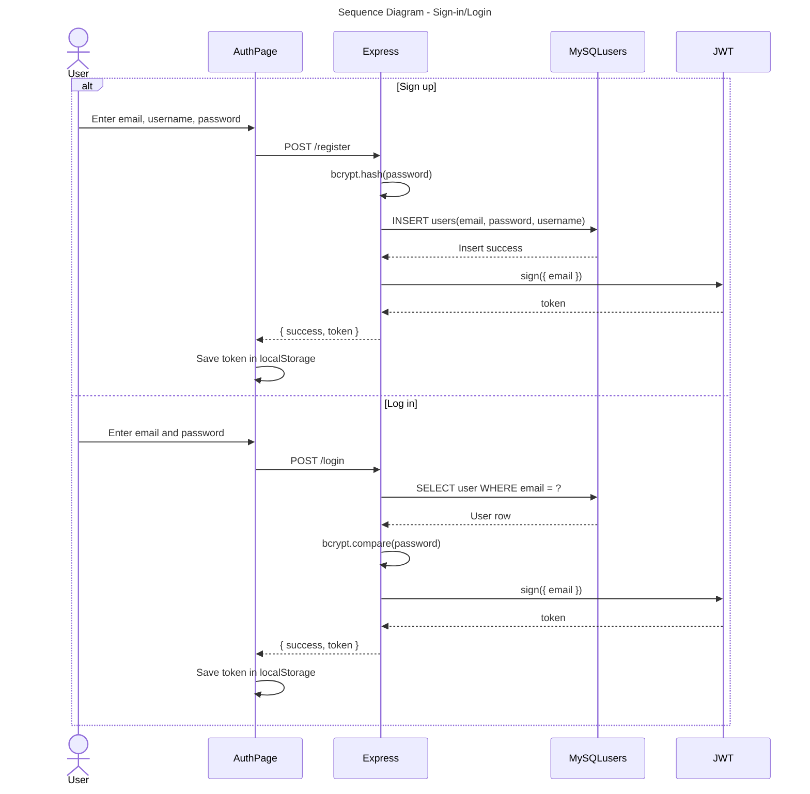
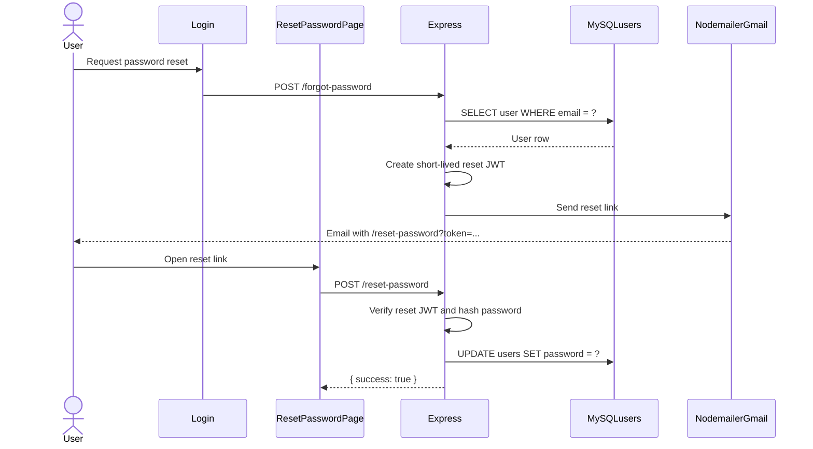
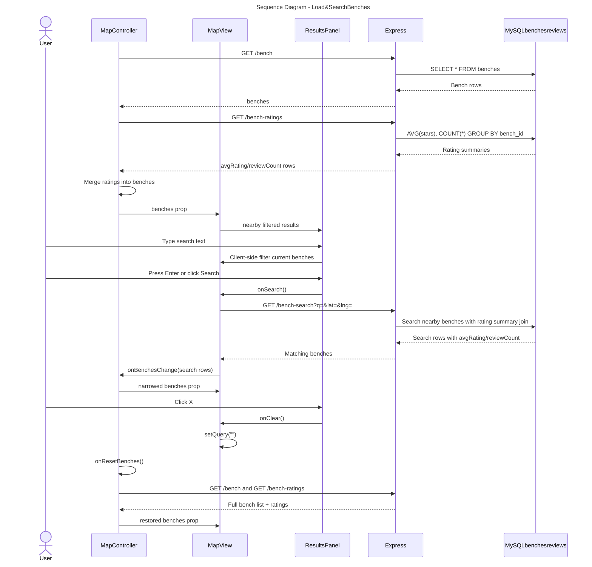
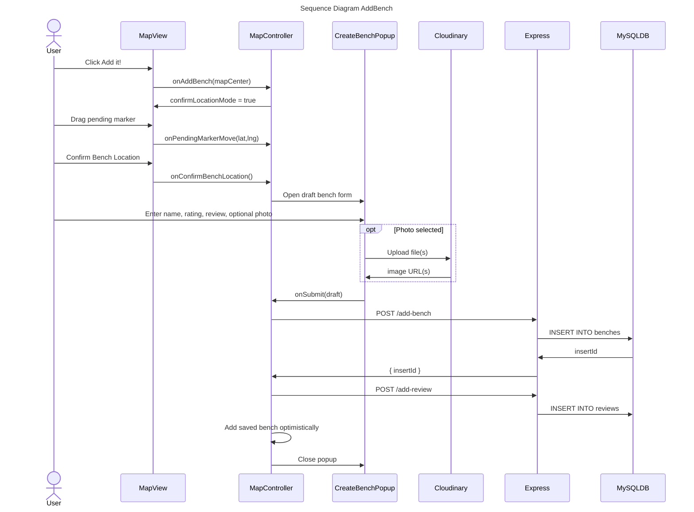
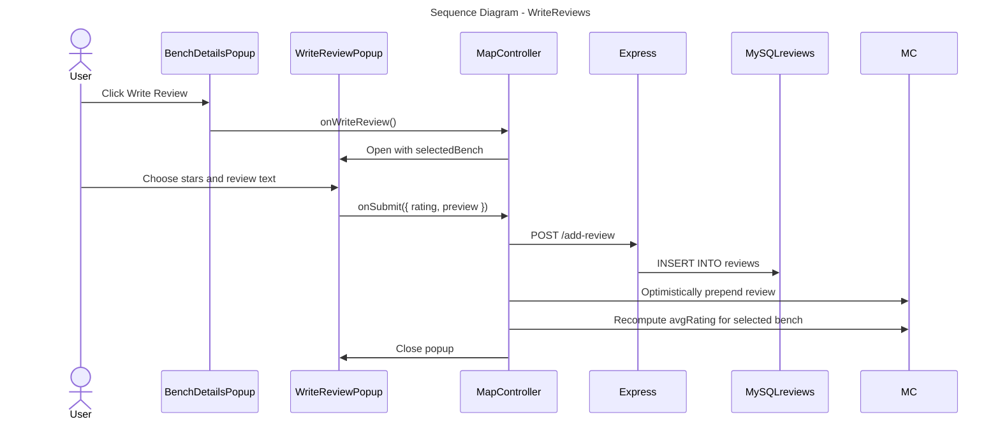
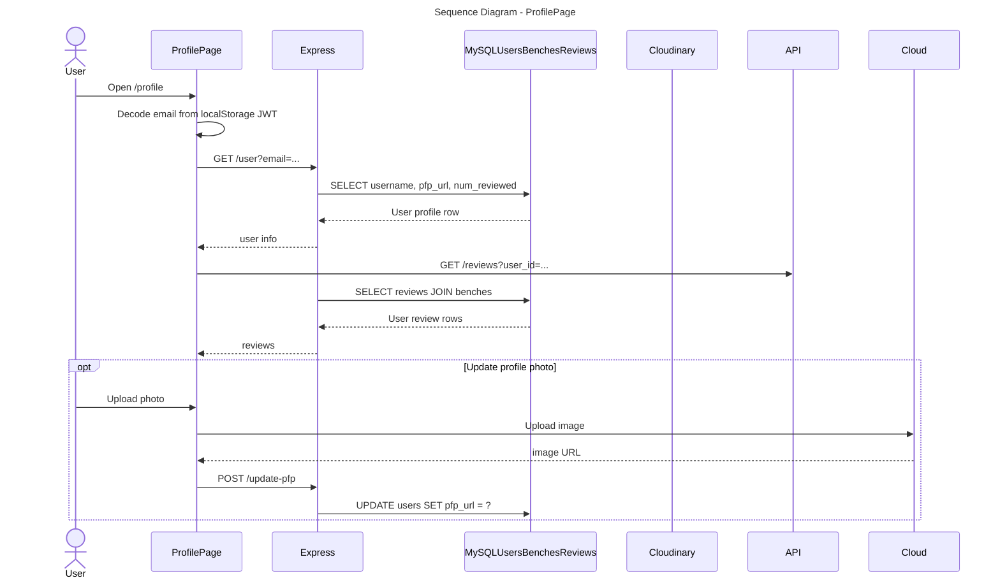
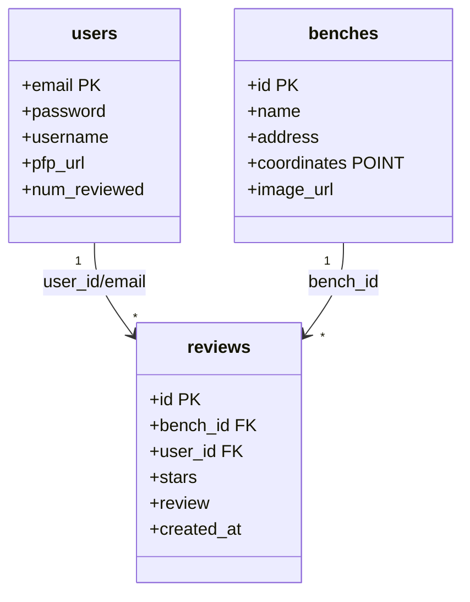

# BenchMark UML Diagrams

These diagrams reflect the current React/Vite frontend, Express backend, and MySQL data flow.

## Sequence Diagram: Sign Up / Log In

## Sequence Diagram: Password Reset

## Sequence Diagram: Load, Search, and Clear Benches

## Sequence Diagram: Add a Bench

## Sequence Diagram: Write a Review for an Existing Bench

## Sequence Diagram: Profile Page

## Class Diagram: Backend Data Model

